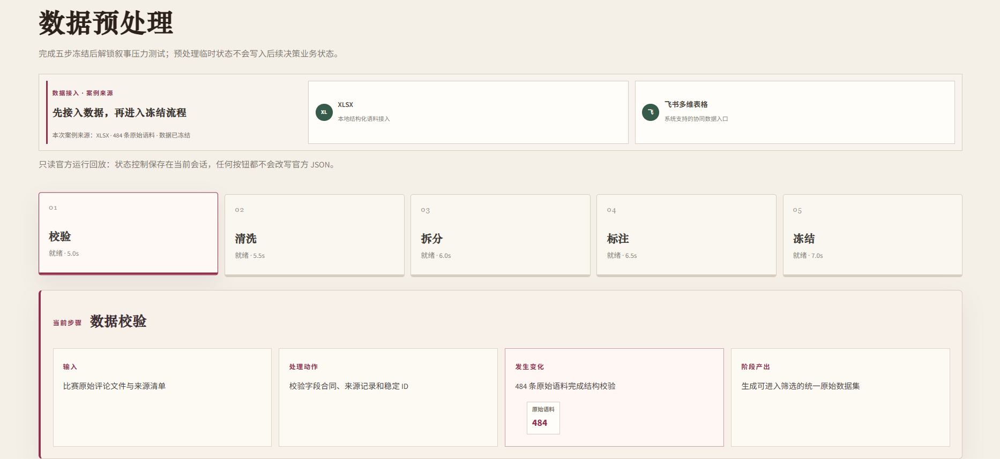
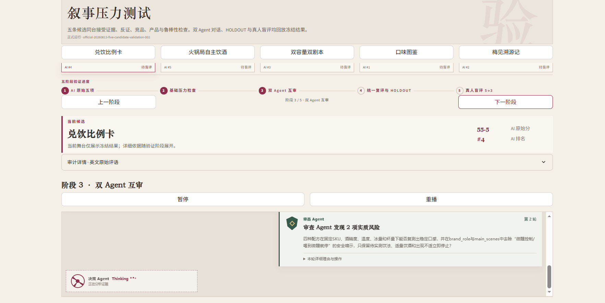
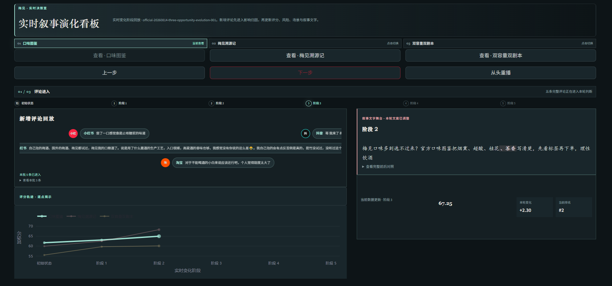

# 梅见品牌叙事智能决策系统

从真实市场意见出发，经过数据预处理、双 Agent 压力测试与增量证据演化，把品牌叙事候选变成可追溯、可质疑、可迭代的决策结果。

[打开 Streamlit 在线案例](https://meijian-narrative-intelligence.streamlit.app)

> 比赛提交版本：`competition-2026-08-15`。在线站点完整开放“梅见案例展示”；在线 AI 与飞书机器人仅在本地配置后启用，公开部署不使用团队密钥。


## 三个展示板块

| 板块 | 输入 | 系统动作 | 输出 |
|---|---|---|---|
| 数据预处理 | 多平台市场评论 | 校验、筛选、分层拆分、AI 标注、证据冻结 | 五条基础品牌叙事机会 |
| 叙事压力测试 | 五条候选与冻结证据 | 五维检查、Luna 审查、DeepSeek 修订、HOLDOUT 与真人盲评 | 三条进入演化的候选 |
| 实时决策看板 | 229 条基线与四批增量证据 | 逐批更新分数、风险、排名和叙事文本 | 三支柱核心叙事与分层场景 |






## 数据与证据边界

- 原始采集 484 条，筛选后有效 419 条。
- 有效集冻结拆分为 `ANALYSIS 249 / GOLD 50 / CHALLENGE_POOL 60 / HOLDOUT 60`。
- 演化展示使用 `229` 条基线与来自 ANALYSIS 的 `20` 条策展式增量，不额外制造样本。
- 案例页面回放由正式链路生成并冻结的结果，不在前端伪装实时模型推理。
- 公开仓库不发布完整 419 条评论、原始平台链接、人工标注表或模型调用过程包；只保留页面实际需要的 40 条脱敏证据摘录与冻结结果。

## 本地运行

要求 Python 3.10。

```powershell
python -m venv .venv
.\.venv\Scripts\Activate.ps1
python -m pip install -r requirements.txt
streamlit run app.py
```

不配置密钥也可以完整查看“梅见案例展示”。如需本地使用在线 AI 或飞书机器人：

```powershell
Copy-Item .env.example .env
# 只在本机填写 .env，严禁提交
python tools/run_feishu_bot.py
```

公开 Streamlit 不配置 `LLM_API_KEY` 或飞书凭据。缺少本地配置时，相关操作会明确显示为不可用，不会降级到伪造结果。

### 飞书决策协作（可选、仅本地）

机器人在通知与回放之外提供决策协作基建：

- 文本命令 `决策进度`：读取 `FEISHU_DECISION_RUN_ROOT` 指向的 coordinator 运行目录，回复当前阶段与可推进操作。
- 决策门排队：卡片回调经 operator 白名单、阶段与选线参数三重校验后进入本地队列；选线类操作必须携带人工显式确认的候选 ID，机器人不会自动选线。
- 写回多维表格：配置 `FEISHU_RUNLOG_URL` / `FEISHU_RESULTS_URL` 后，机器人启动时只读盘点目标表字段，缺失即拒绝；运行日志与冻结产物经本地队列实时追加写入。
- 决策门执行器（coordinator 调用）尚未接线，接线前门按钮会明确提示未启用。

## 自由链路（自定义使用 · 本地真实推理）

冻结案例之外，系统包含一条可实际运行的自定义决策链：`src/services/decision_runner.py` 编排
语料分析 → 多样性评估 → 候选生成 → 加权评分 → 鲁棒性扰动 → 逐候选压力测试 →
挑战批修订 → 选线 → HOLDOUT 验证 → 冻结 → 增量批演化，全部通过 `LLMClient` 实时调用模型。
『梅见案例展示』入口只回放冻结产物，不经过自由链路。

本地使用方式（与展示共用同三个工作区，按序解锁）：

1. 『数据预处理』：以自定义使用入口导入自己的评论数据（Excel/CSV 或飞书多维表格，不限规模，≥10 条），由本地模型在线标注（每批 10–20 条）后发布；发布即解锁下一工作区。至少发布三个语料包（基线 / 挑战 / holdout，可选更多作为增量批），自定义语料全部进入 ANALYSIS 允许集合，不套用官方案例的数据规模与配额。
2. 『叙事压力测试』：选择基线与挑战语料包，一键完成基线分析与五维压力检查，应用挑战批触发候选修订；完成后解锁看板。
3. 『实时决策看板』：确认选线 → holdout 验证 → 冻结快照 → 逐批释放增量，实时展示排名、压力检查、文本修订与换线建议。

官方案例的冻结产物由同一套链路离线生成（`tools/run_official_decision.py`）；自由链路的结果仅保留在当前会话中用于核对，不会写回冻结数据。线上公开部署不配置模型密钥，因此自由链路仅本地可用。

## 仓库结构

| 路径 | 内容 |
|---|---|
| `app.py` | Streamlit 入口与各工作区编排 |
| `src/ui/` | 系统入口、预处理、压力测试、演化看板与自由决策实验界面 |
| `src/services/` | 冻结产物校验、投影、决策链编排与本地协同服务 |
| `data/` | 最小冻结展示包与脱敏证据目录 |
| `prompts/` | 当前运行仍引用的 Prompt |
| `tools/run_feishu_bot.py` | 仅本地配置后启动的飞书长连接入口 |
| `tools/run_official_decision.py` | 官方冻结案例的离线生成入口（本地真实链路） |
| `tests/` | 提交范围、数据边界、无密钥行为与自由链路干跑验收 |

## 安全说明

- `.env`、`.streamlit/secrets.toml`、通知数据库、日志和上传文件均被 Git 排除。
- 仓库未附开源许可证，保留全部权利。
- 品牌叙事候选是待验证决策材料，不构成事实承诺；请理性饮酒，仅限法定饮酒年龄成年人。
